# OpenVPN Setup

## Setup & Creating profile

On your VPS, download this convenient script from `angristan`: https://github.com/angristan/openvpn-install

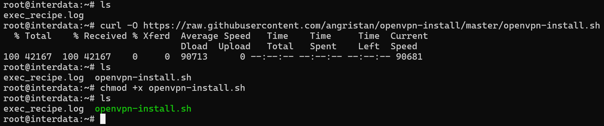

Then run the script to start the setup (just need to press ENTER):


Then it will ask you to create the first client:


We will create first client with name `player` and press ENTER, it will then ask you if you want to create password for this client:

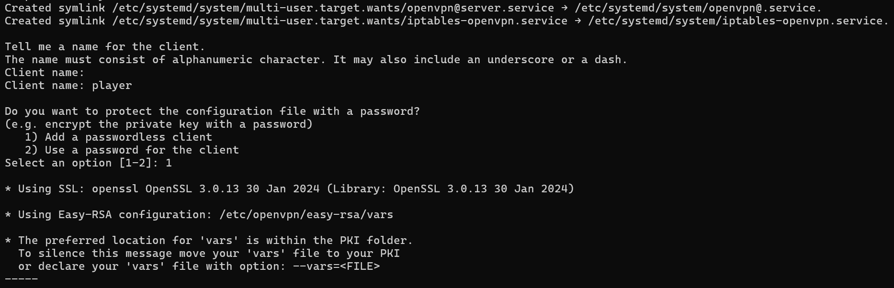

Just type ENTER (option 1 for passwordless client) and we get the first configuration:

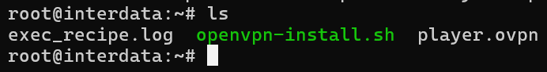

This configuration will then be distribute to our player for accessing team machines. Now let's create 2 more configs for team 1 and team 2:


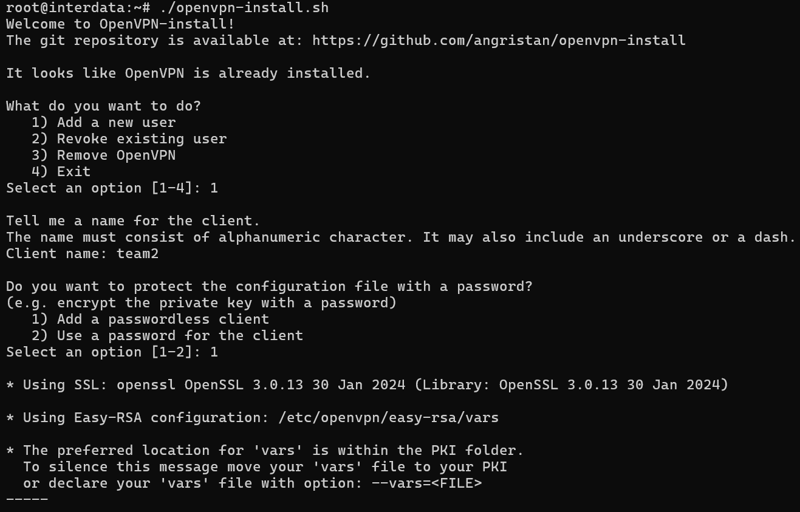

Now we have team1 and team2 profiles:

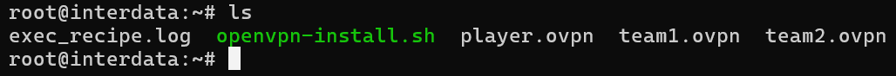

Wait, we have not done yet! We will need to config a few things before it is done!

## Client configuration - Assigning static IP

Let's go to `/etc/openvpn/ccd`:

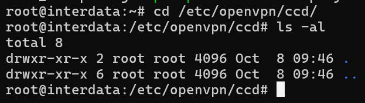

In here, we will create 2 files called `team1` and `team2` with the content as following (name of file has to match name of VPN profile, if you create file with different name, the static ip will not be assigned):

team1:
```
ifconfig-push 10.8.0.11 255.255.255.0
```

team2:
```
ifconfig-push 10.8.0.12 255.255.255.0
```

Let's check those 2 files:

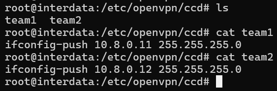

## Server configuration

Now we will run these commands to config `server.conf` in `/etc/openvpn/server.conf`:

```bash
sed -i 's/server 10.8.0.0 255.255.255.0/#server 10.8.0.0 255.255.255.0/g' /etc/openvpn/server.conf
sed -i 's/push "dhcp-option/#push "dhcp-option/g' /etc/openvpn/server.conf
sed -i 's/push "redirect-gateway def1 bypass-dhcp"/#push "redirect-gateway def1 bypass-dhcp"/g' /etc/openvpn/server.conf
echo '' >> /etc/openvpn/server.conf
echo 'server 10.8.0.0 255.255.255.0 nopool' >> /etc/openvpn/server.conf
echo 'ifconfig-pool 10.8.0.20 10.8.0.254' >> /etc/openvpn/server.conf
echo 'duplicate-cn' >> /etc/openvpn/server.conf
```

Before we modify `server.conf`:


After we modify `server.conf`:

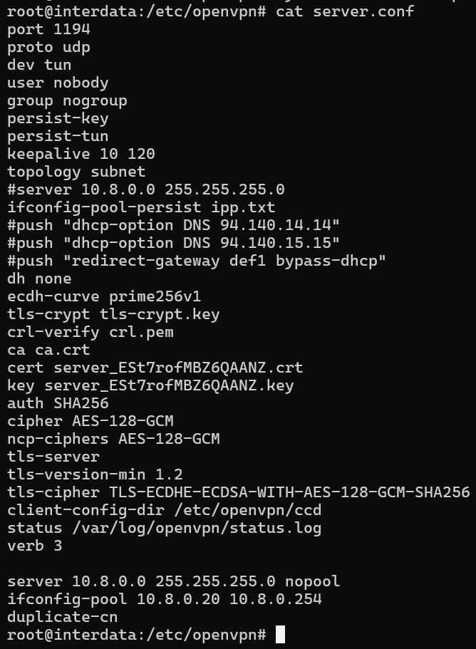

Let's restart and enable openvpn to run on startup:

```bash
sudo systemctl restart openvpn
sudo systemctl enable openvpn
```

## Firewall configuration

Normally, VPS only opens port 22 (SSH):

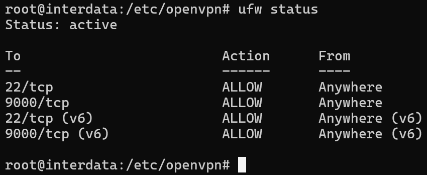

But as we have setup above, it uses port 1194 with UDP protocol so if a client wants to connect to our OpenVPN server, that port has to be opened:

```bash
sudo ufw allow 1194/udp
```

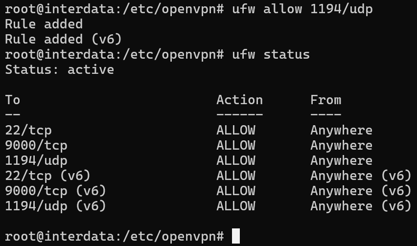

> You can use `iptables` instead but I prefer `ufw` because it's faster and more convenient!

Next, generally on VPS, the policy for chain `FORWARD` is drop:

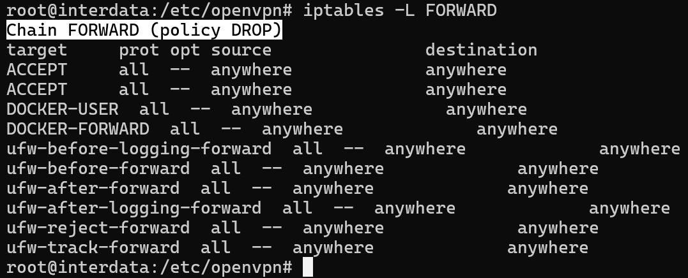

So if a client use `player.ovpn`, it still cannot connect to teams (ping result show that the packet has been redirected):

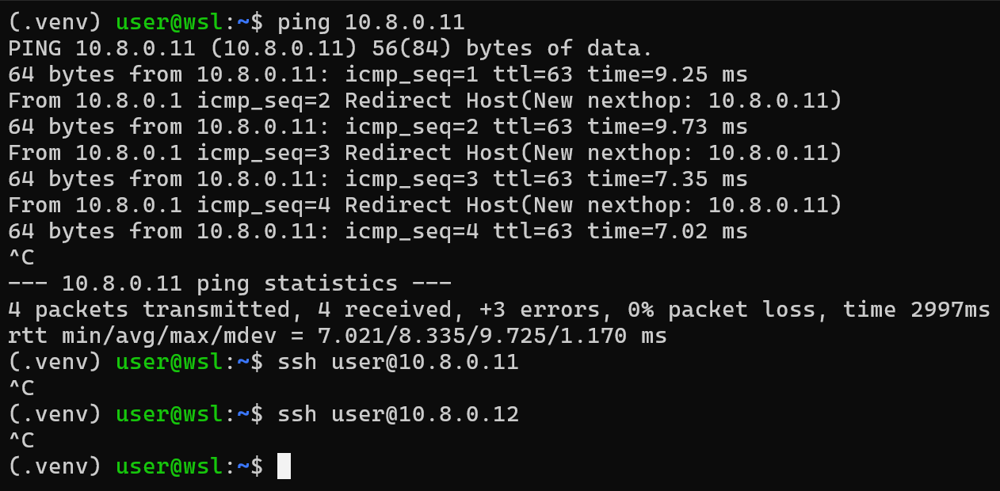

To allow that action, we just need to run this command on VPS:

```bash
sudo iptables -A FORWARD -m iprange --src-range 10.8.0.20-10.8.0.254 -d 10.8.0.0/24 -j ACCEPT
```

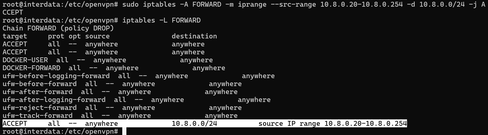

When we ping or connect again, it succeeds:

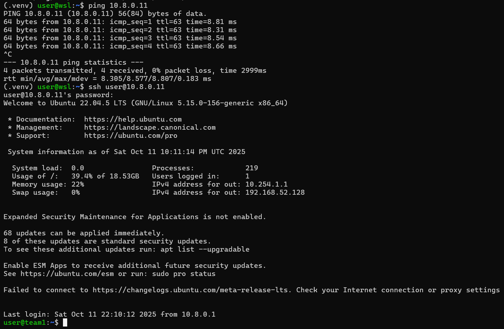

Congratulation! You have just configured your brand new OpenVPN server successfully.
