# Attack & Defense Lab

This repo contains 3 labs and with each lab, you will need to config differently:
- Lab1: Central <--> Proxy <--> Service
- Lab2: Central <--> Service
- Lab3: Central

# Menu

- [Challenge Writing](#challenge-writing-menu)
- [Checker Writing](#checker-writing-menu)
- [Flag submission](#flag-submission-menu)
- [ForcAD Issues](#forcad-issues-menu)
    - [Issue 1: Change admin password](#issue-1-change-admin-password-menu)
    - [Issue 2: Debug docker](#issue-2-debug-docker-menu)
    - [Issue 3: Mouting in Docker-in-Docker](#issue-3-mouting-in-docker-in-docker-menu)
    - [Issue 4: No space left on device](#issue-4-no-space-left-on-device-menu)
    - [Issue 5: Install apt package for checker](#issue-5-install-apt-package-for-checker-menu)
    - [Issue 6: Cannot ssh to team](#issue-6-cannot-ssh-to-team-menu)
    - [Issue 7: Use output of `put` as flag_id of `get`](#issue-7-use-output-of-put-as-flag_id-of-get-menu)

# Challenge Writing ([Menu](#menu))

```
FROM ubuntu:22.04

### DO NOT CHANGE THESE LINES ##################
ENV DEBIAN_FRONTEND=noninteractive

RUN apt-get update
RUN apt-get install -y openssh-server
RUN apt-get clean

RUN useradd -m ctf && \
	echo "ctf:ctf" | chpasswd && \
	echo /bin/bash | chsh ctf

# If you want to put and get flag via ssh, uncomment these lines below
# which means flag is 1 or 2 file only with binary getflag will read flag2
#ARG SSHKEY
#RUN mkdir /root/.ssh && \
	echo $SSHKEY > /root/.ssh/authorized_keys
#RUN touch /flag1 && \
	chmod 644 /flag1
#ADD getflag /getflag
#RUN touch /flag2 && \
	chmod 600 /flag2 && \
	chmod +xs /getflag
################################################

RUN apt-get update
RUN apt-get clean

ADD getflag /getflag
ADD web1/file /file

CMD ["/bin/sh"]
```

If everything is done, run the following command in bash to build

```bash
docker compose build
```

If you enable SSHKEY, you will need to pass public key data when building:

```bash
docker compose build --build-arg SSHKEY="`cat /root/.ssh/id_rsa.pub`"
```

After it built successful, we can run docker image now:

```
docker compose up --detach
```

# Checker Writing ([Menu](#menu))

I have a template for checker [here](template/checkers).

Basically, we just need `checker.py`. But because I want to have some function to interact with server so I added `backend.py` and then I can write code in `backend.py`, which make `checker.py` cleaner.

- ***Situation 1: race condition between `check()`, `put()` and `get`***

Because those 3 function can be run at the same time so if challenge cannot generate random data with each connection, it can cause race condition. The best way is to use `filelock` and `time` of python framework to prevent that!

- ***Situation 2: put and get flag via SSH***

In case you want to put and get flag via SSH, use `paramiko` in python to support that:

```python
import paramiko

HOSTNAME = '192.168.0.1'
PORT = 22
USERNAME = 'root'
PASSWORD = 'root'
PRIVATE_KEY = '/root/.ssh/id_rsa'

client = paramiko.SSHClient()
client.set_missing_host_key_policy(paramiko.AutoAddPolicy())
client.connect(HOSTNAME, port=PORT, username=USERNAME, password=PASSWORD)
# client.connect(HOSTNAME, port=PORT, username=USERNAME, key_filename=PRIVATE_KEY)
client.exec_command(f"echo {flag} > /flag1")
client.close()
```

If flag is 1, there are no problems. But if flag files are 2, 2 flags can be put in 1 file which will lead to `GET failed` so here is a workaround to deal with that:

```python
def put(self, flag_id: str, flag: str, vuln: str):
    lock = FileLock(f"/tmp/.web1_{self.cm.get_port()}")
    try:
        client = paramiko.SSHClient()
        client.set_missing_host_key_policy(paramiko.AutoAddPolicy())
        client.connect('192.168.0.1', port=self.cm.get_ssh_port(), username='root', key_filename="/checkers/id_rsa")
        with lock:
            filename = f'/tmp/web1_{self.cm.get_port()}'
            if not os.path.exists(filename) or int(open(filename, 'r').read())==0:
                client.exec_command(f"echo {flag} > /flag1")
                client.close()
                open(filename, 'w').write('1')
            elif int(open(filename, 'r').read())==1:
                client.exec_command(f"echo {flag} > /flag2")
                client.close()
                open(filename, 'w').write('0')
    except Exception as e:
        self.cquit(Status.MUMBLE, 'put failed', f'{e}')
    self.cquit(Status.OK)

def get(self, flag_id: str, flag: str, vuln: str):
    client = paramiko.SSHClient()
    client.set_missing_host_key_policy(paramiko.AutoAddPolicy())
    client.connect('192.168.0.1', port=self.cm.get_ssh_port(), username='root',  key_filename="/checkers/id_rsa")

    flag_path = ['/flag1', '/flag2']
    is_the_same = False
    for path in flag_path:
	    stdin, stdout, stderr = client.exec_command(f"cat {path}")
	    res = stdout.readline()
    	if res.strip()==flag:
    		is_the_same = True
    		break
    client.close()
    if not is_the_same:
        self.cquit(Status.CORRUPT, 'get failed', f'Flag: {res1};{res2}')
    else:
	    self.cquit(Status.OK)
```


When running `init.sh` script, the script has already generatee a ssh key and copied to `/ForcAD/checkers` so in case you want to put and get flag via ssh of root, you can write script using key at `/checkers/id_rsa`

# Flag submission ([Menu](#menu))

API for submitting flag:

```bash
curl -X PUT \
     -H "X-Team-Token: <TOKEN>" \
     -d '["<FLAG_1>", "<FLAG_2>"]' \
     10.254.0.254/flags
```

Explain:
- `TOKEN` can be retrieved by executing `control.py print_tokens` on central machine
- `FLAG_1`, `FLAG_2` are flags

# ForcAD Guideline ([Menu](#menu))

First, you will need to write config to `config.yml` then run:

```bash
./control.py setup
./control.py build
./control.py start
```

To get team's token, run:

```bash
./control.py print_tokens
```

To stop ForcAD, run:

```bash
./control.py reset
```

# ForcAD Issues ([Menu](#menu))

## Issue 1: Change admin password ([Menu](#menu))

- ***Situation 1: Forgotten password***

If you want to change admin password (username is `forcad`, password is forgotten), let's jump into docker of PostGres:

```cmd
sudo docker exec -it <container-id> bash
```

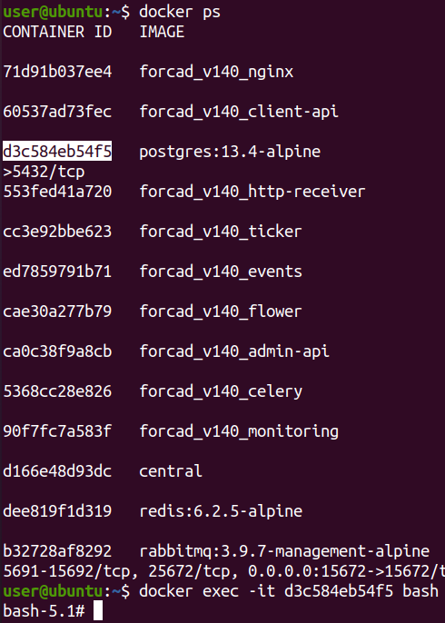

Then execute `psql`. If you get error as following:

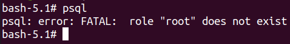

You will need to run this command first:

```cmd
export PGUSER=forcad
```

Then run `psql` again will give us PostGreSQL shell:

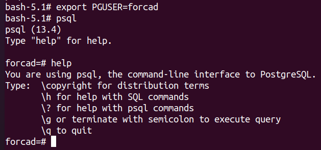

Now you want to change password of forcad user, type:

```
ALTER USER <username> WITH PASSWORD '<new-password>';
```

Let's say you want to change forcad's password to `abc123`, type:

```
ALTER USER forcad WITH PASSWORD 'abc123';
```

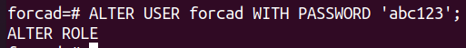

If the command is correct, it will output that string `ALTER ROLE`. Note that the shell I enter SQL command has `=`, not the one with `-`. This is the correct one:

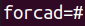

This is the wrong shell:

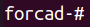

If you are in the wrong shell, just press `Ctrl + C` to get back the right shell!

- ***Situation 2: Known password***

You can install psql in your host and then run:

```
psql -h 0.0.0.0 -U forcad
```

It will ask for your password, then you enter password and you can get into PostGreSQL shell! With that shell, you can do as instructed in ***Case 1*** to change password.

## Issue 2: Debug docker ([Menu](#menu))

While a docker is booting, it will echo data out. We can get all data just by using `docker logs` to see if the init script works as desired. Let's check with PostGreSQL container:

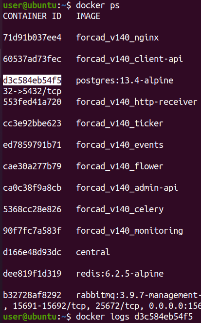

It will output something useful if you want to debug where it gets error. Another container you might need to debug is initializer:

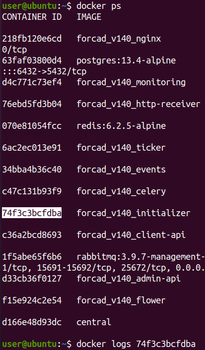

The logs can show you if there are any steps broken:

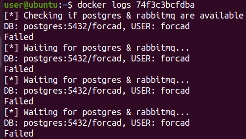

## Issue 3: Mouting in Docker-in-Docker ([Menu](#menu))

> Ref: https://stackoverflow.com/a/62413225/17872100

Because we are running a docker, now if we run ForcAD, that means run another docker inside a docker but ForcAD also need to mount a file, that's a big problem. Let's say we have here:

```
Host (your physical computer): H
Team docker: D1
ForcAD docker: D2
```

Because I'm using method 1 as [this link](https://kodekloud.com/blog/run-docker-in-docker-container/#1-mounting-the-hostE28099s-docker-socket) described, so if I want to mount a volumn (file or directory) when I'm in D1, it will take the path of H, not D1. For example, first we are in host and we will run docker D1 with a dir mounted:

```cmd
sudo docker run -v /D1:/D1 -it D1
```

It will create folder `/D1` in our host and `/D1` on D1. Now we are in D1, we want to run D2 inside D1 and mount a dir:

```cmd
sudo docker run -v /D2:/D2 -it D2
```

After we access D2, we check D2 has `/D2` and host has `/D2` but not D1. You can read reference (on title) for more details.


## Issue 4: No space left on device ([Menu](#menu))

> Ref: https://stackoverflow.com/a/75036976/17872100

When you run ForcAD but it doesn't work as normal, you can try to read the logs from initializer:

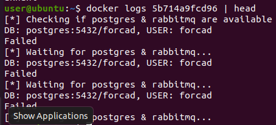

Still error from postgres, let's see its logs:

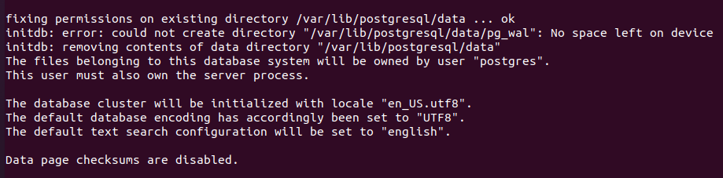

No space left? So the only way is to prune (delete) everything from docker:

```cmd
docker system prune --volumes --all
```

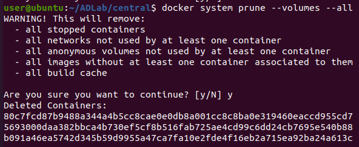

## Issue 5: Install apt package for checker ([Menu](#menu))

> Ref: https://github.com/pomo-mondreganto/ForcAD/wiki/Writing-a-checker#modifying-checker-container

Install python package is easy because you can add package to file:

```
$FORCAD_PATH/checkers/requirements.txt
```

Then that python package will be install when it builds docker. So what about apt package?

The docker that is responsible for checking services is `celery` and Dockerfile is located at:

```
$FORCAD_PATH/docker_config/celery/Dockerfile
```

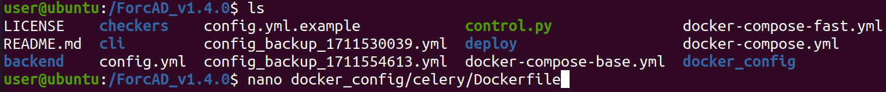

So you can add docker command to build apt package, such as you want to install curl, just add this line:

```
RUN apt-get update && apt-get install -y curl
```

You can add that line at anywhere in Dockerfile but I prefer somewhere at the end of file:

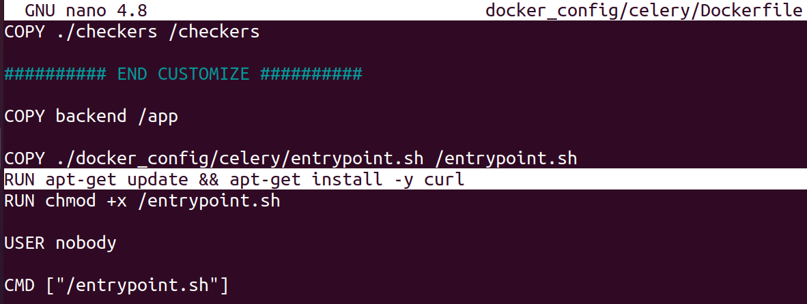

Then build the image and start again:

```cmd
sudo ./control.py build
sudo ./control.py start
```

If you want to check, you can access the celery docker:

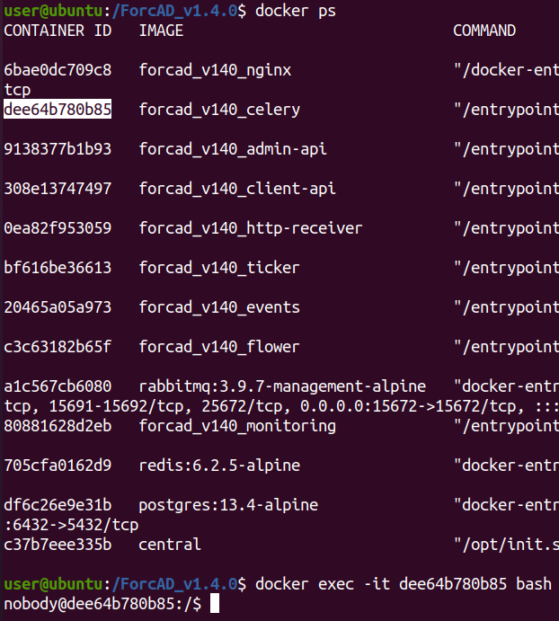

If you want to check if your checker works as expected or not, you can run it directly with that shell:

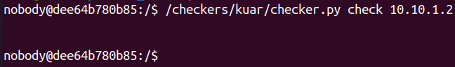

Nothing output means it successfully check! If it has error output, you can also see that when login to admin and click to service of team, it will show error like this:

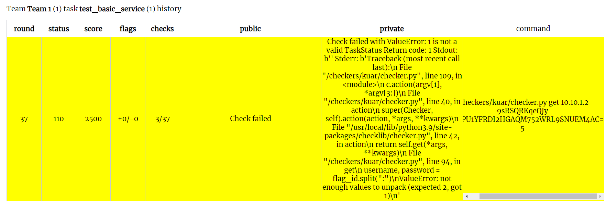

When we take that command and run in celery shell, its output is the same:

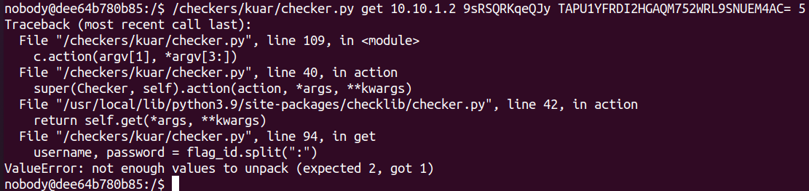

## Issue 6: Cannot ssh to team ([Menu](#menu))

It can be that both your host and docker team is running SSH server so when a person SSH, it will connect to host, not docker.

Solution is to shutdown ssh server on your host. SSH again will jump directly to docker!

## Issue 7: Docker TLS handshake timeout

> Ref: https://stackoverflow.com/a/44668720

When building docker images, you get this error:


That means docker cannot resolve the domain. To fix that, add the following content to file `/etc/docker/daemon.json`:

```
{
  "dns": ["8.8.8.8", "8.8.4.4"]
}
```

Then restart docker:

```bash
systemctl restart docker
```

And check again:

```bash
docker run busybox nslookup google.com
```

However, if you 

## Issue 7: Use output of `put` as flag_id of `get` ([Menu](#menu))

> Ref: https://github.com/pomo-mondreganto/ForcAD/wiki/Writing-a-checker

Just simply print data to stdout in `put` function and that data will be flag_id for `get` function
