# Attack & Defense Lab (module 1)

> 1 machine for checker, scoreboard

> 2 machines for teams

> 2 machines for services of each team

## Topology

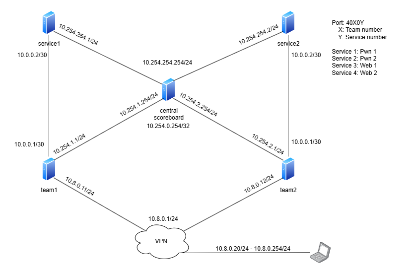

## VMnet Configuration

In this lab, we will use from **VMnet2** to **VMnet6**:
- **VMnet2** (subnet `10.254.1.0/24`): for central vs team1
- **VMnet3** (subnet `10.0.0.0/30`): for team1 vs service1
- **VMnet4** (subnet `10.254.2.0/30`): for central vs team2
- **VMnet5** (subnet `10.0.0.0/30`): for team2 vs service2
- **VMnet6** (subnet `10.254.254.0/24`): for central vs service1 and service2 to put and get flag via SSH

On taskbar, go to `Edit -> Virtual Network Editor...`:


Click at `Change Settings` to gain permission:

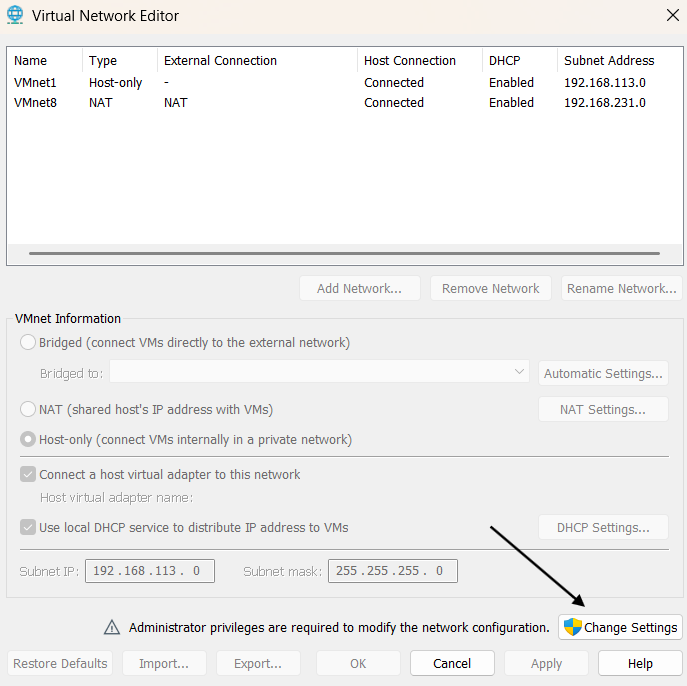

To add new VMnet, just click at `Add Network..`:


Then select name for it and click `OK`:


Do the same with VMnet3, VMnet4, VMnet5 and VMnet6. After you are done, check again and we see that VMnet2 to VMnet6 have been added successfully (**do not change subnet address, just leave it as it is**):

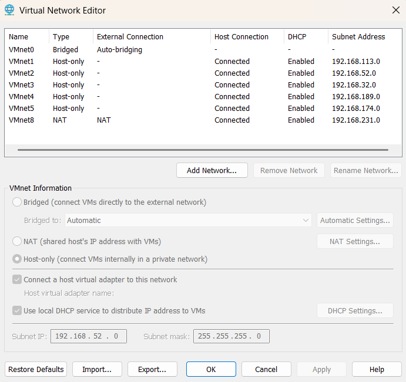

Don't worry about those `Subnet Address`, it will help you connect to VM from your host. Now click `Apply` and `OK` to close.

## VMware Configuration

### ------ **Central machine**

First, we will need to install 4 network adapter on **central** machine (remember to match VMnet with the correct adapter name):
- `Network Adapter` is set to **NAT**
- `Network Adapter 2` is set to **VMnet2**
- `Network Adapter 3` is set to **VMnet4**:
- `Network Adapter 4` is set to **VMnet6**:

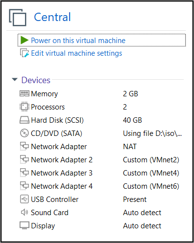

Those network adaters have to be in that order, if you see the order is as below:
- `Network Adapter`
- `Network Adapter 2`
- `Network Adapter 4`
- `Network Adapter 3`

Then you will need to remove `Network Adapter 4` and add again until `Network Adapter 4` is below `Network Adapter 3`. If it is done, let's setup our team machines!

### ------ **Team machine**

For team 1, `Network Adapter` will be **VMnet2** and `Network Adapter 2` will be **VMnet3**:

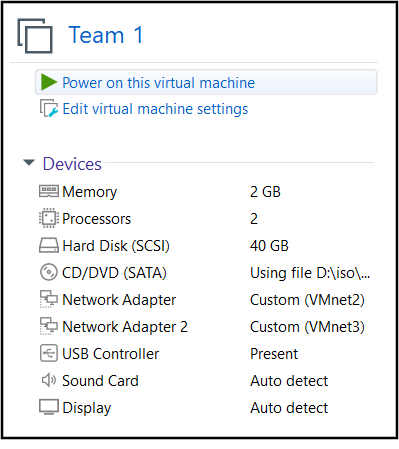

For team 2, `Network Adapter` will be **VMnet4** and `Network Adapter 2` will be **VMnet5**:

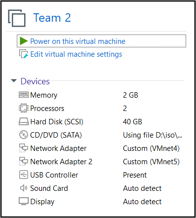

Let's move on service machines!

### ------ **Service machine**

For service 1, `Network Adapter` will be **VMnet3** and `Network Adapter 2` will be **VMnet6**:

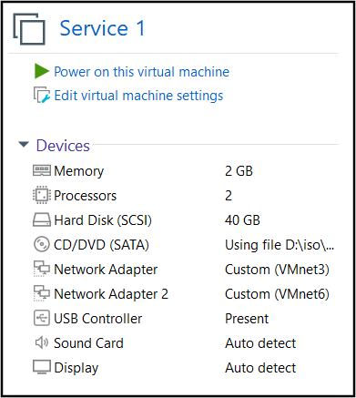

For service 2, `Network Adapter` will be **VMnet5** and `Network Adapter 2` will be **VMnet6**:

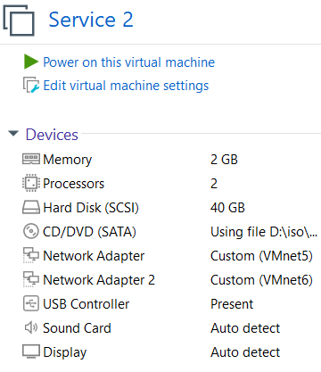

That's all we needed. Now let's install necessary stuff!

## Setup

### ------ **Central machine**

On central, we already have access to Internet because of NAT adapter so let's config on central first. We will transfer `central.sh` into machine using `scp` (and `ForcAD.zip` with `checkers.zip` if you have already downloaded) then run script with these required parameters:

```bash
./central.sh [OPTION]... --out INTERFACE_OUT --team1 INTERFACE_TEAM1 --team2 INTERFACE_TEAM2 --in INTERFACE_IN -f FORCAD_URL -c CHECKER_URL
```

Explanation:
- `INTERFACE_OUT`: Interface using **NAT**
- `INTERFACE_TEAM1`: Interface using **VMnet2**
- `INTERFACE_TEAM2`: Interface using **VMnet4**
- `INTERFACE_IN`: Interface using **VMnet6**
- `FORCAD_URL`: link to download ForcAD.zip
- `CHECKER_URL`: link to download checkers.zip

In my example, let's check all interface name:

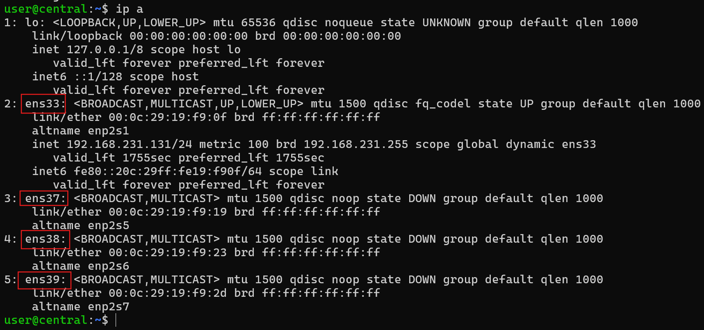

So we can see **ens33** is **NAT**, **ens37** is **VMnet2**, **ens38** is **VMnet4** and **ens39** is **VMnet6** (they are in the same order as Network Adapter Card). For `ForcAD.zip` and `checkers.zip`, you can get it from release section. Below is an example of full command running `central.sh`:

```bash
./central.sh --out ens33 --team1 ens37 --team2 ens38 --in ens39 -f https://github.com/ -c https://github.com/
```

> This script will also generate a new SSH key pair and put private key in `/ForcAD/checkers` just in case you need it.

Now we will want to **route traffic** from team 1 to team 2 and vice versa. We will use is `nginx` and below is an example for `/etc/nginx/nginx.conf` that you will want to modify:

```
worker_processes auto;
pid /run/nginx.pid;
include /etc/nginx/modules-enabled/*.conf;

events {
        worker_connections 768;
}

stream {
    server {
        listen 40101;
        proxy_pass 10.254.1.1:9001;
    }
    server {
        listen 40201;
        proxy_pass 10.254.2.1:9001;
    }
}
```

Explaination:
- `listen`: Port that central will bind on
- `proxy_pass`: Destination that central will redirect traffic to

Modify `/etc/nginx/nginx.conf` with your config, then run the command below to check if config is correct:

```
nginx -t
```

If config can work, we will get successful message:

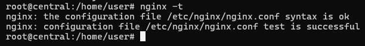

Now we just need to restart nginx service to update with new configuration:

```
systemctl restart nginx
```

Finally, go to `/ForcAD`, write your `config.yml` then run:

```bash
./control.py setup
./control.py build
./control.py start
```

Central machine is now set. Let's setup on team machine!

### ------ **Team machine**

Let's copy the script `team.sh` into machine via `scp`, then `ssh` into it and we can run that script to setup team machine. The script require these parameters:

```bash
./team.sh [OPTION]... --out INTERFACE_OUT --in INTERFACE_IN --team TEAM_NUMBER
```
Below is an example of full command running `team.sh`:

```bash
./team.sh --out ens33 --in ens37 --team 1
```

After running the script and we can get access to the internet now:

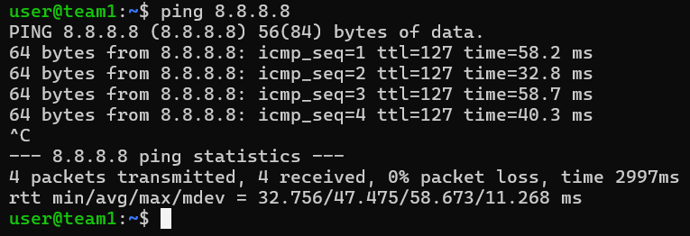

Let's download VPN configs of 2 teams to our host:

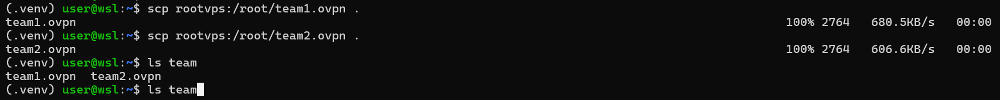

Then let's copy those configs to corresponding machines:


Now, let's SSH to team 1, then move the file `team1.ovpn` from `/home/user/team1.ovpn` to `/etc/openvpn/team1.conf`:


To start openvpn on team 1, type:

```bash
sudo systemctl start openvpn@team1
sudo systemctl enable openvpn@team1
```

If VPN is on, we can see ip is assigned and we can ping to server:

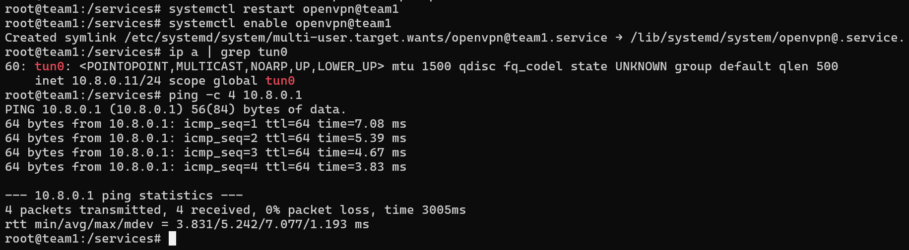

On our host, or another host, run config `player.ovpn` first:

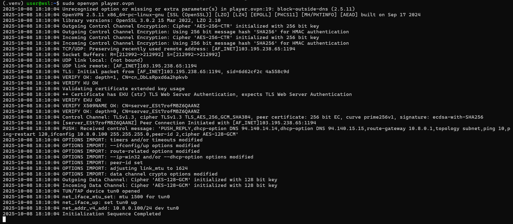

Now let's try to SSH to team 1, whose IP is `10.8.0.11`:

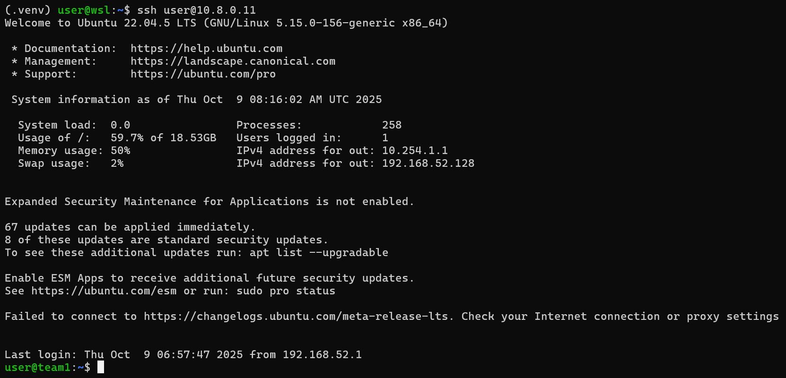

Setup for team 2 is similar:

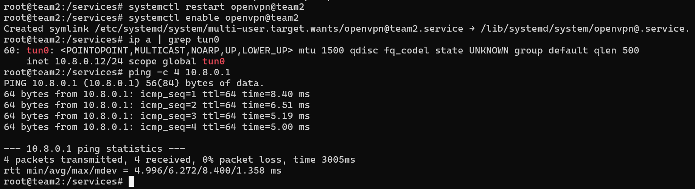

If everything is correct, we can SSH to our team 2:


### ------ **Service machine**

Let's copy the script `service.sh` into machine via `scp`, then `ssh` into it and we can run that script to setup service machine. The script require these parameters:

```bash
./team.sh [OPTION]... --out INTERFACE_OUT --in INTERFACE_IN --team TEAM_NUMBER -s SERVICE_URL
```
Below is an example of full command running `team.sh`:

```bash
./team.sh --out ens33 --in ens37 --team 1 -s https://github.com/
```

If a challenge need to put flag via SSH, you can copy public key from `central` in `/root/.ssh/id_rsa.pub` into this machine. After you run the script, this service can access the internet:

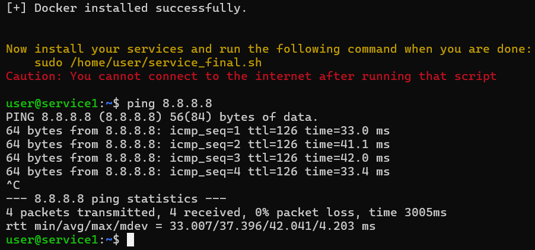

Can you see the warning line:

```
Now install your services and run the following command when you are done:
    sudo /home/user/service_final.sh
Caution: You cannot connect to the internet after running that script
```

The script has created a new script located at `/home/user/service_final.sh`. For this module, the service will not be outbound to avoid reverse shell (i.g). Currently, if you have not executed the script `/home/user/service_final.sh`, you can still connect to the internet. 

**Install your services first!**:

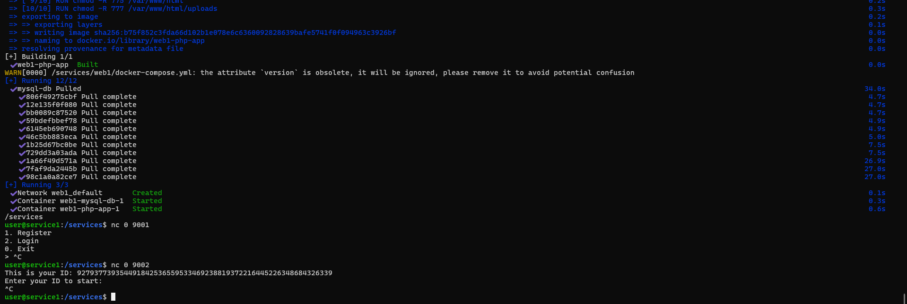

Make sure that your services work properly. If they are, it's time to run that final script:

```bash
sudo /home/user/service_final.sh
```

After you run this script, **your SSH connection will be lost!** However, there is another way to SSH to service machine. If you check the topology above, you can see central machine has same subnet with service machine so you can SSH to central then from central, SSH to service:

Central to service 1:
```bash
ssh user@10.254.254.1
```

Central to service 2:
```bash
ssh user@10.254.254.2
```

Finally, from central, make sure you can connect to your services via team ip:

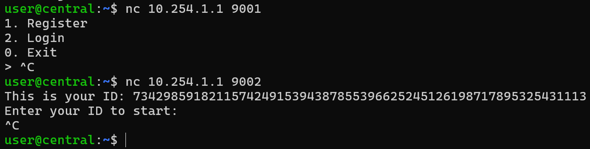