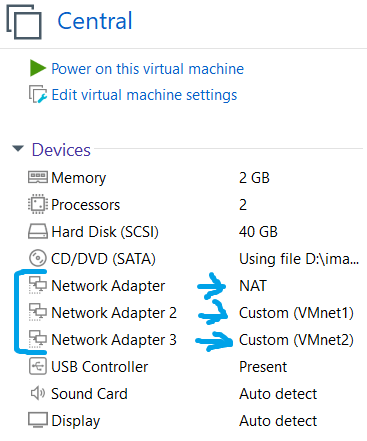
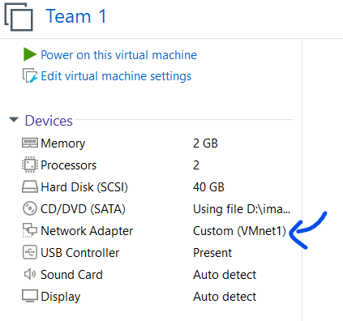
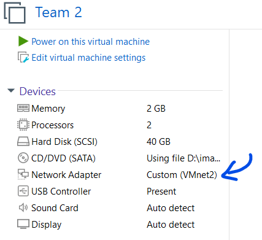
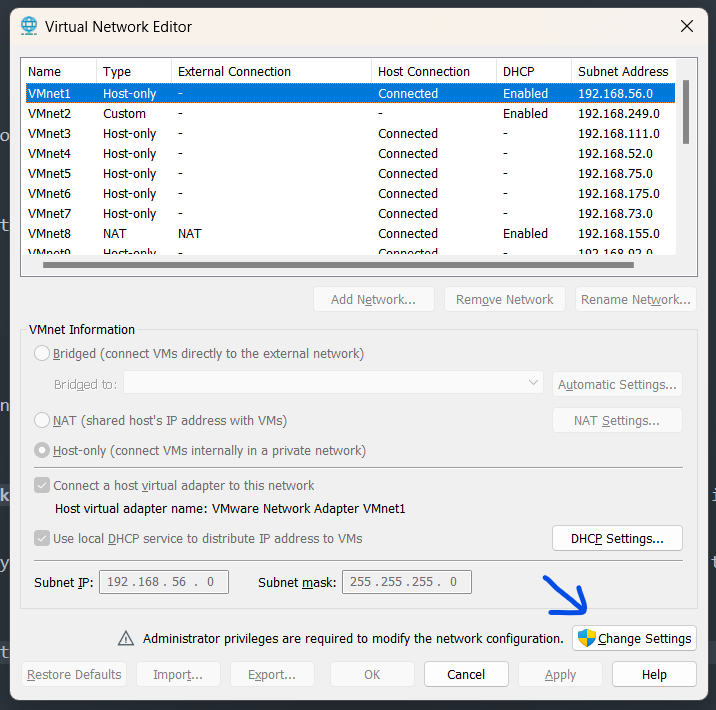
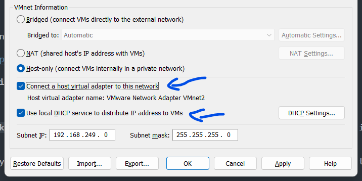
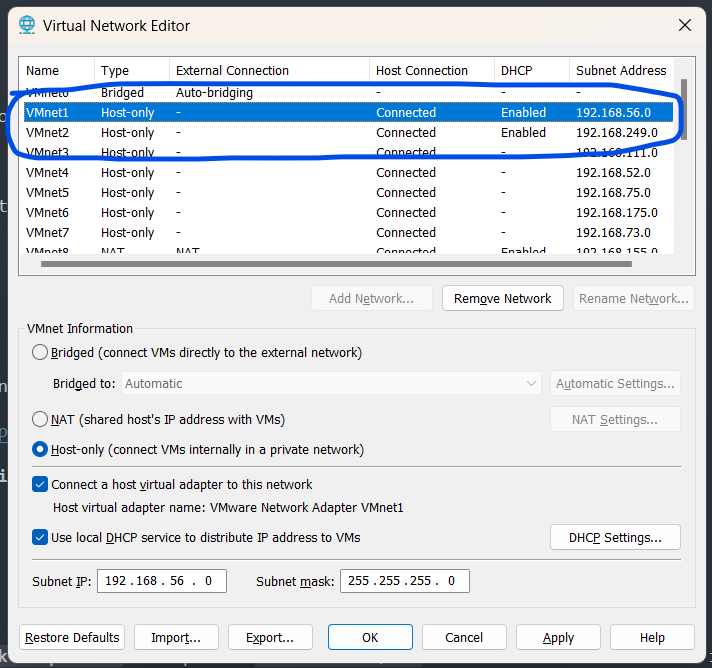

# Attack & Defense Lab (module 2)

> 1 machine for checker, scoreboard

> 2 machines for teams containing services

## Application
- [ForcAD](https://github.com/pomo-mondreganto/ForcAD/releases/tag/v1.4.0)
- [Docker](https://docs.docker.com/engine/install/ubuntu/)
- Openvpn

## Setup

### VMware configuration

First, we will need to install 3 network adapter on **central** machine:
- `Network Adapter` is set to **NAT**
- `Network Adapter 2` is set to **VMnet1**
- `Network Adapter 3` is set to **VMnet2**:



Now we will config `Network Adapter` of team 1 into **VMnet1**:



Then we will config `Network Adapter` of team 2 into **VMnet2**:



Then we go to `Edit -> Virtual Network Editor...`:


and click `Change Settings` to config **VMnet1** and **VMnet2**:



Now we will want 2 vmnets have both **Host connection** connected and **DHCP** enabled by ticking at 2 boxes:



and it should look like this:



That's all configuration we needed. Now let's install necessary stuff!

### Installation

On central, we already have access to Internet because of NAT adapter so let's install on central first. We will run the script `central.sh` with these required parameters:

```bash
./central.sh [OPTION]... -f FORCAD-URL -c CHECKER-URL --lo SERVER-IP --ip1 IP1 --ip2 IP2
```

Explanation:
- `FORCAD-URL`: link to download ForcAD.zip
- `CHECKER-URL`: link to download checkers.zip
- `SERVER-IP`: ip of server to communicate with team1
- `IP1`: ip of server to communicate with team1
- `IP2`: ip of server to communicate with team2

For example, below are interface names on central machine (`ens34` and `ens38`):


I will assume team 1's network is `10.254.1.0/24` and team 2's network is `10.254.2.0/24` so I can set central ip to `10.254.1.1` and `10.254.2.1` for `ens34` and `ens38`, respectively. For `ForcAD.zip` and `checkers.zip`, you can get it from release section. Below is a full command running `central.sh` to setup with `ForcAD.zip` and `checkers.zip` I uploaded to Mediafire for public access (you will need to generate new link for that):

```bash
./central.sh -f https://download1528.mediafire.com/h4az9jqmejfg6olNoEZ_EnD9qNJBY_IqkKadXd23l8ZFyjHepzJiwqGUZ2V6fbuDJC2wMD68Jw25DKiFfN7acEY-AV5zLDjdGhFEFISJQFkN0rVFd8HBjd76EPu0O8CebQxzFQV8fMU72d6OanVW1reTdX1qgUncI_QuhgQ0ug/dxj0c3wt67tjcr8/ForcAD.zip -c https://download1479.mediafire.com/zankd1kz41wgQ8zcV-MnWa4WGUco7hWMYPUC5052p5EgQZKjBRATq0w0XFx1Aki6LnraSsHNlXQOrguGJm2hUe3Aq3xumBuuRuzO-ckNEroR-Y9OHwhSfhWlyo2qsd3hE45hdYR3Nh9vRST9uAh0jmCHEanSHLhjLOlaUmHuJA/39u04c47qcr4h0j/checkers_1.zip --if1 ens34 --ip1 10.254.1.1 --if2 ens38 --ip2 10.254.2.1
```

If everything works fine, central machine is now set. Let's setup on team machine!

With option **Host connection** connected we have configured previously, our host machine can ping to vmware of team 1 and team 2 with ip assigned by DHCP:


Now we will want to change that ip to fit our use. First, we will `ssh` to team machine and delete all files in `/etc/netplan/`:

```bash
sudo rm -rf /etc/netplan/*
```

Next, we will create a new network config file at this path `/etc/netplan/01-team-network.yaml` with content below:

```
network:
    version: 2
    ethernets:
        enp2s1:
            optional: true
            dhcp4: false
            addresses: [<CLIENT-IP>/24]
            routes:
              - to: default
                via: <SERVER-IP>
```

Remember to replace `<CLIENT-IP>` and `<SERVER-IP>` with the one you choose. Then we will set permission for that file and update ip with our new config:

```bash
sudo chmod 600 "/etc/netplan/01-team-network.yaml"
sudo netplan apply
```

For example, the below config will change ip to `10.254.1.2` and default gateway to `10.254.1.1`:

```
network:
    version: 2
    ethernets:
        enp2s1:
            optional: true
            dhcp4: false
            addresses: [10.254.1.2/24]
            routes:
              - to: default
                via: 10.254.1.1
```

And when you 


The script **`init.sh`** will config the **`Network Adapter 2`**'s ip to **`192.168.0.1/24`** so that bot can use this ip to check services.

- Building challenge
In addition, **init.sh** will also generate ssh key and store it in `/root/.ssh/` so when writing docker, you can take the template in challenge folder and build with command below:

```bash
docker compose build --build-arg SSHKEY="`cat /root/.ssh/id_rsa.pub`"
```

After it built successful, we can run challenge docker with the following command:

```bash
docker compose up --detach
```

- Building ForcAD

In this lab, I designed the checker to ssh as root to service docker and update flag in that so we will need to move the sshkey from `/root/.ssh/id_rsa` to `/ForcAD/id_rsa` so that it can include the key to checker container and the checker can work!

## Challenge Writing

There is a folder called `services` with hierarchy as following:
```
services
├── getflag
├── web1
│   ├── docker-compose.yml
│   ├── Dockerfile
└── web2
    ├── docker-compose.yml
    └── Dockerfile
```

For each challenge, you will need to build service for each team. Here is an example of `docker-compose.yml`:

```
services:
	team1web1:
		build: .
		hostname: web1team1
		ports:
			- "10101:80"
			- "10121:22"
	team2web1:
		build: .
		hostname: web1team2
		ports:
			- "10201:80"
			- "10221:22"
```

So in your `Dockerfile`, when you want to add `file2` into docker of chall web1, you will need to specify the path with the folder name and then file name as following:

```
ADD web1/file /file
```

Instead of:

```
ADD file /file
```

Because at `.`, which means at `services` folder, there is no file called `file2`. But in case you want to add `file1` into both of chall webs so you can add this line to both `Dockerfile`s:

```
ADD getflag /getflag
```

This is a valid command because at `.`, which means at `services` folder, there is a file called `file1`. Here is an example of your `Dockerfile` with some note in it:

```
FROM ubuntu:22.04

### DO NOT CHANGE THESE LINES ##################
ENV DEBIAN_FRONTEND=noninteractive

RUN apt-get update
RUN apt-get install -y openssh-server
RUN apt-get clean

RUN useradd -m ctf && \
	echo "ctf:ctf" | chpasswd && \
	echo /bin/bash | chsh ctf

# If you want to put and get flag via ssh, uncomment these lines below
# which means flag is 1 or 2 file only with binary getflag will read flag2
#ARG SSHKEY
#RUN mkdir /root/.ssh && \
	echo $SSHKEY > /root/.ssh/authorized_keys
#RUN touch /flag1 && \
	chmod 644 /flag1
#ADD getflag /getflag
#RUN touch /flag2 && \
	chmod 600 /flag2 && \
	chmod +xs /getflag
################################################

RUN apt-get update
RUN apt-get clean

ADD getflag /getflag
ADD web1/file /file

CMD ["/bin/sh"]
```

If everything is done, run the following command in bash to build

```bash
docker compose build
```

If you enable SSHKEY, you will need to pass public key data when building:

```bash
docker compose build --build-arg SSHKEY="`cat /root/.ssh/id_rsa.pub`"
```

After it built successful, we can run docker image now:

```
docker compose up --detach
```

## Checker Writing

There is a folder called `checkers` with its hierarchy as following:

```
checkers
├── requirements.txt
├── web1
│   └── checker.py
└── web2
    └── checker.py
```

When running `init.sh` script, the script has already generatee a ssh key and copied to `/ForcAD/checkers` so in case you want to put and get flag via ssh of root, you can write script using key at `/checkers/id_rsa`

## Troubleshoot

