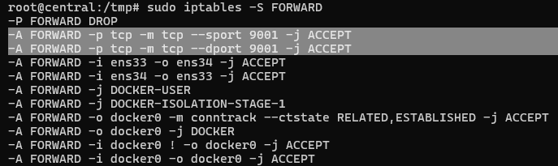
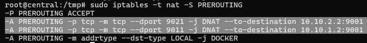

# Attack & Defense Lab (module 2)

> 1 machine for checker, scoreboard

> 2 machines for teams containing services

## Application
- [ForcAD](https://github.com/pomo-mondreganto/ForcAD/releases/tag/v1.4.0)
- [Docker](https://docs.docker.com/engine/install/ubuntu/)
- Openvpn

## Setup

<details>
	<summary>VMware configuration</summary>
<p>

------ **Central machine**

First, we will need to install 3 network adapter on **central** machine (remember to match VMnet with the correct adapter name):
- `Network Adapter` is set to **NAT**
- `Network Adapter 2` is set to **VMnet1**
- `Network Adapter 3` is set to **VMnet2**:


------ **Team machine**

Now we will config `Network Adapter` of team 1 into **VMnet1**:


Then we will config `Network Adapter` of team 2 into **VMnet2**:


Then we go to `Edit -> Virtual Network Editor...`:


and click `Change Settings` to config **VMnet1** and **VMnet2**:


Now we will want 2 vmnets have both **Host connection** connected and **DHCP** enabled by ticking at 2 boxes:


and it should look like this:


That's all we needed. Now let's setup necessary stuff!

</p>
</details>

<details>
	<summary>Installation</summary>
<p>

------ **Central machine**

On central, we already have access to Internet because of NAT adapter so let's install on central first. We will run the script `central.sh` with these required parameters:

```bash
./central.sh [OPTION]... -f FORCAD-URL -c CHECKER-URL --lo SERVER-IP --ip1 IP1 --ip2 IP2
```

Explanation:
- `FORCAD-URL`: link to download ForcAD.zip
- `CHECKER-URL`: link to download checkers.zip
- `SERVER-IP`: general ip that all team will use to attack (or view scoreboard)
- `IP1`: ip of server to communicate with team1
- `IP2`: ip of server to communicate with team2

For example, I will assume team 1's network is `10.254.1.0/24` and team 2's network is `10.254.2.0/24` so I can set `--ip1` to `10.254.1.1`, `--ip2` `10.254.2.1` and server ip to `10.254.0.254`. For `ForcAD.zip` and `checkers.zip`, you can get it from release section. Below is an example of full command running `central.sh` (you will need to generate new link for those files):

```bash
./central.sh -f https://download1528.mediafire.com/h4az9jqmejfg6olNoEZ_EnD9qNJBY_IqkKadXd23l8ZFyjHepzJiwqGUZ2V6fbuDJC2wMD68Jw25DKiFfN7acEY-AV5zLDjdGhFEFISJQFkN0rVFd8HBjd76EPu0O8CebQxzFQV8fMU72d6OanVW1reTdX1qgUncI_QuhgQ0ug/dxj0c3wt67tjcr8/ForcAD.zip -c https://download1479.mediafire.com/zankd1kz41wgQ8zcV-MnWa4WGUco7hWMYPUC5052p5EgQZKjBRATq0w0XFx1Aki6LnraSsHNlXQOrguGJm2hUe3Aq3xumBuuRuzO-ckNEroR-Y9OHwhSfhWlyo2qsd3hE45hdYR3Nh9vRST9uAh0jmCHEanSHLhjLOlaUmHuJA/39u04c47qcr4h0j/checkers_1.zip --if1 ens34 --ip1 10.254.1.1 --if2 ens38 --ip2 10.254.2.1
```

This script will also generate a new SSH key pair and put private key in `/ForcAD/checkers` just in case you need it. Now when we want to config routing so that 2 teams can communicate with each other via central machine, there is a customized script called `iptables_config` and a file `routing.json` (data is in json format). Here is an example config of `routing.json`:

```
{
	"rules": [
		{
			"listen": 9011,
			"proxy_ip": "10.10.1.2",
			"proxy_port": 9001
		},
		{
			"listen": 9021,
			"proxy_ip": "10.10.2.2",
			"proxy_port": 9001
		}
	]
}
```

Explanation:
- `listen`: The port that server will bind at
- `proxy_ip`: The ip that central will redirect traffic to
- `proxy_port`: The port that central will redirect traffic to

With that example config and let's assume central ip is `10.10.0.1`, the central will listen on `10.10.0.1:9011` and whenever a team connect to that port, traffic will be routing to `10.10.1.2:9001`. You will want to modify that to fit your use and run `iptables_config ./routing.json` to config iptables. The script will modify 2 chains is `FORWARD` and `PREROUTING`, which you can view its rules with following commands:

```bash
sudo iptables -S FORWARD
sudo iptables -t nat -S PREROUTING
```

Example of FORWARD chain:



Example of PREROUTING chain:



Central machine is now set. Let's setup on team machine!

------ **Team machine**

With option **Host connection** connected we have configured previously, our host machine can ping to vmware machine of team 1 and team 2 with ip assigned by DHCP:


So let's `scp` the script `team.sh` into machine, then `ssh` into it and we can run that script to setup team machine. Below is an example of full command running `team.sh`:

```bash
./team.sh -s https://download1479.mediafire.com/25o8m8prcfjgcB-GE4TSzFmlAv7zU2Gdki_fY9jydo1cBScSvPXrDPFIxGWwEoc52Nfaw0tLfEkBjQRWSuN-9udgZ_5D1891J1Y6H0ltgo7aS8j9c5tm-036JGJ-Qp3Y-Ci6YSAKLyBODXAx97zqR6l0l5qZm1W-65sbS33qfSMXxQ/vszd1tzthg1fi3s/services_1.zip --cip 10.254.1.2 --sip 10.254.1.1
```

If a challenge need to put flag via SSH, you can copy public key from central in `/root/.ssh/id_rsa.pub` into team machine. 

</p>
</details>