# Attack & Defense Lab (module 2)

> 1 machine for checker, scoreboard

> 2 machines for teams containing services

## VPN Configuration

On your VPS, download this convenient script: https://github.com/angristan/openvpn-install


Then run the script to start the setup (just need to press ENTER):

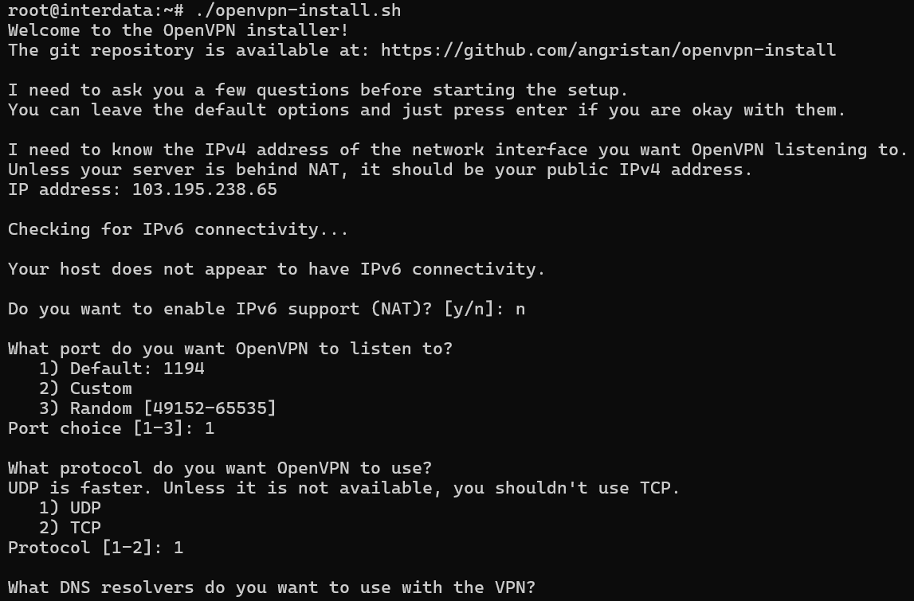

Then it will ask you to create the first client:

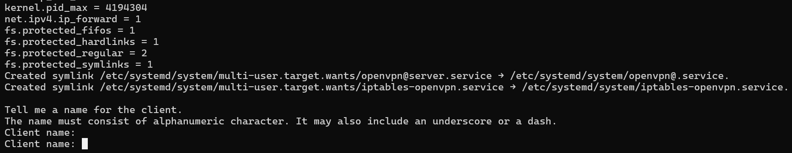

We will create first client with name `player` and press ENTER, it will then ask you if you want to create password for this client:


Just type ENTER (option 1 for passwordless) and we get the first configuration:


This configuration will then be distribute to our player for accessing team machine. Now let's create 2 more configs for team 1 and team 2:

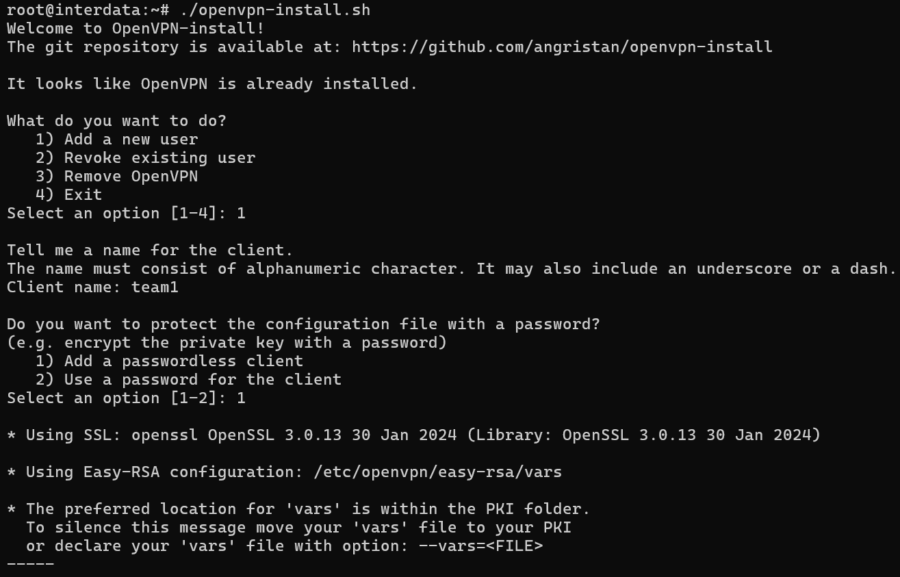


So now we have team1 and team2 VPN configuration:


Wait, we have not done yet! We will need to config a few things before it is done! First, go to dir `/etc/openvpn/ccd`:


In here, we will create 2 files called `team1` and `team2` with the content as following (name of file has to match name of VPN client, if you create file with different name, the static ip will not be assigned):

team1:
```
ifconfig-push 10.8.0.11 255.255.255.0
```

team2:
```
ifconfig-push 10.8.0.12 255.255.255.0
```

Let's check those 2 files:


Now we will run these commands to config `server.conf` in `/etc/openvpn/server.conf`:

```bash
sed -i 's/push "redirect-gateway def1 bypass-dhcp"/#push "redirect-gateway def1 bypass-dhcp"/g' /etc/openvpn/server.conf
sed -i 's/server 10.8.0.0 255.255.255.0/#server 10.8.0.0 255.255.255.0/g' /etc/openvpn/server.conf
echo '' >> /etc/openvpn/server.conf
echo 'server 10.8.0.0 255.255.255.0 nopool' >> /etc/openvpn/server.conf
echo 'ifconfig-pool 10.8.0.20 10.8.0.254' >> /etc/openvpn/server.conf
echo 'duplicate-cn' >> /etc/openvpn/server.conf
```

Before we modify `server.conf`:

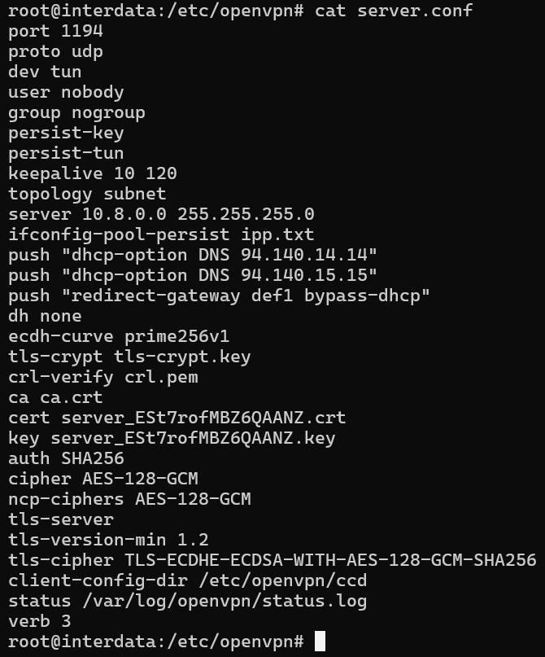

After we modify `server.conf`:

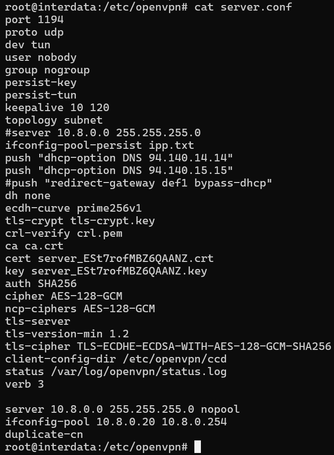

Let's restart openvpn:

```bash
sudo systemctl restart openvpn
```

Currently, client use `player.ovpn` still cannot connect to teams, we just need to run this command:

```
iptables -A FORWARD -m iprange --src-range 10.8.0.20-10.8.0.254 -d 10.8.0.0/24 -j ACCEPT
```

That's done for VPN configuration. Let's move on!

## VMware Configuration

### ------ **Central machine**

First, we will need to install 3 network adapter on **central** machine (remember to match VMnet with the correct adapter name):
- `Network Adapter` is set to **NAT**
- `Network Adapter 2` is set to **VMnet2**
- `Network Adapter 3` is set to **VMnet3**:

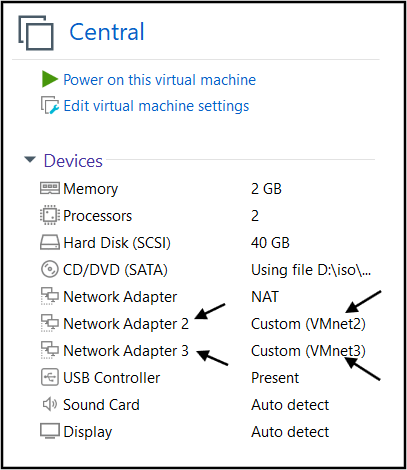

Then we go to `Edit -> Virtual Network Editor...`:

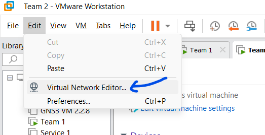

As you can see I don't have VMnet2 and VMnet3, so let's add them. Click at `Change Settings` to gain permission:


To add new VMnet, just click at `Add Network..`:

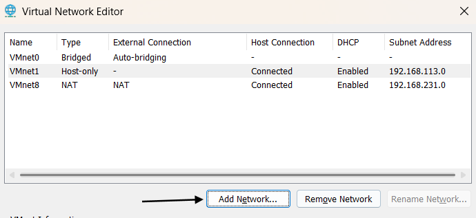

Then select VMnet2 and click `OK`:

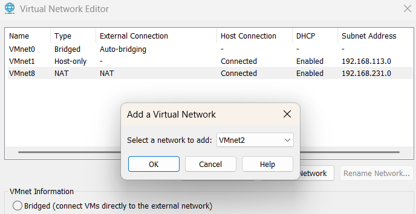

Do the same with VMnet3:

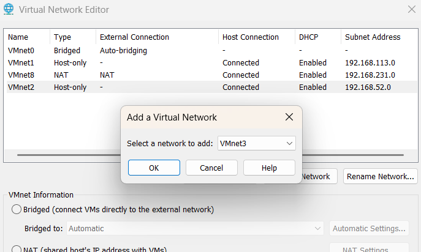

Check again and we see that VMnet2 and VMnet3 have been added successfully. Now click `Apply` and `OK` to close this popup:

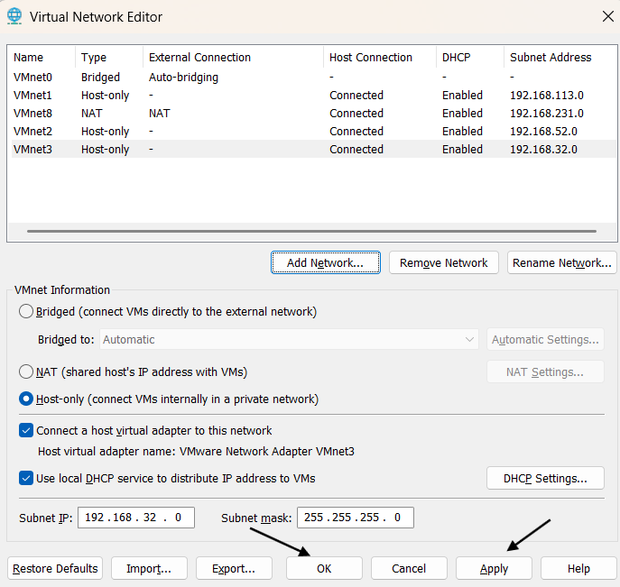

That's good! Let's setup our team machines!

### ------ **Team machine**

Now we will config `Network Adapter` of team 1 into **VMnet2**:

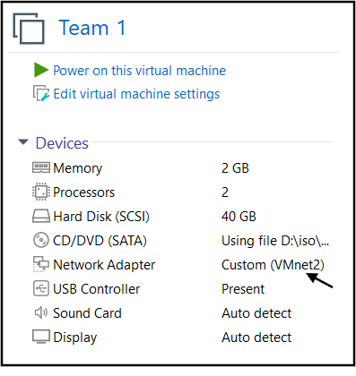

Then we will config `Network Adapter` of team 2 into **VMnet3**:

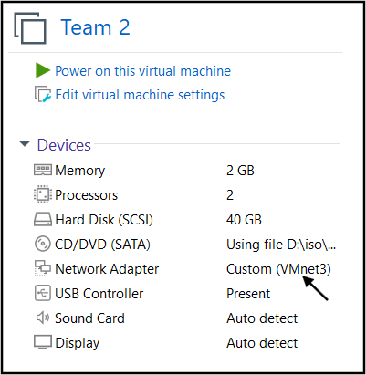

That's all we needed. Now let's setup necessary stuff!

## Setup

### ------ **Central machine**

On central, we already have access to Internet because of NAT adapter so let's config on central first. We will transfer `central.sh` into machine using `scp` and then run that script with these required parameters:

```bash
./central.sh [OPTION]... --out INTERFACE_OUT --team1 INTERFACE_TEAM1 --team2 INTERFACE_TEAM2 -f FORCAD_URL -c CHECKER_URL
```

Explanation:
- `INTERFACE_OUT`: general ip that all team will use to attack (or view scoreboard)
- `INTERFACE_TEAM1`: ip of server to communicate with team1
- `INTERFACE_TEAM2`: ip of server to communicate with team2
- `FORCAD_URL`: link to download ForcAD.zip
- `CHECKER_URL`: link to download checkers.zip

In my example, let's check all interface name:

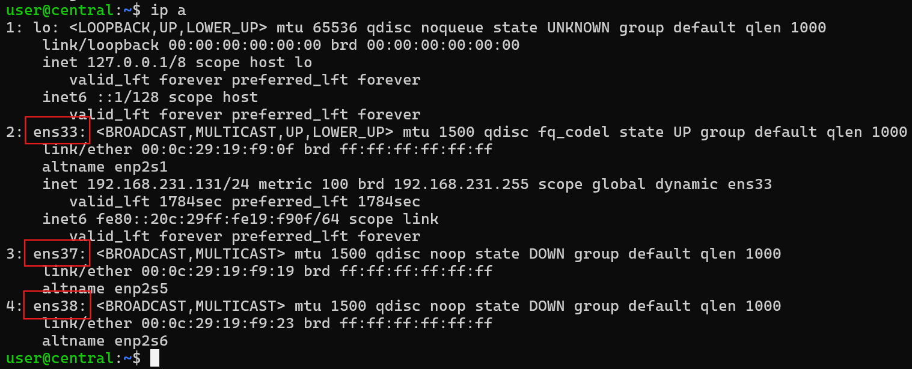

So we can see ens33 is NAT, ens37 is VMnet2 and ens38 is VMnet3 (they are in the same order as Network Adapter Card). For `ForcAD.zip` and `checkers.zip`, you can get it from release section. Below is an example of full command running `central.sh`:

```bash
./central.sh --out ens33 --team1 ens37 --team2 ens38 -f https://github.com/ -c https://github.com/
```

> This script will also generate a new SSH key pair and put private key in `/ForcAD/checkers` just in case you need it.

Now we will want to **route traffic** from team 1 to team 2 and vice versa. We will use is `nginx` and below is an example for `/etc/nginx/nginx.conf` that you will want to modify:

```
worker_processes auto;
pid /run/nginx.pid;
include /etc/nginx/modules-enabled/*.conf;

events {
        worker_connections 768;
}

stream {
    server {
        listen 40101;
        proxy_pass 10.254.1.1:9001;
    }
    server {
        listen 40201;
        proxy_pass 10.254.2.1:9001;
    }
}
```

Explaination:
- `listen`: Port that central will bind on
- `proxy_pass`: Destination that central will redirect traffic to

Modify `/etc/nginx/nginx.conf` with your config, then run the command below to check if config is correct:

```
nginx -t
```

If config can work, we will get successful message:


Now we just need to restart nginx service to update with new configuration:

```
systemctl restart nginx
```

Finally, go to `/ForcAD`, write your `config.yml` then run:

```bash
./control.py setup
./control.py build
./control.py start
```

Central machine is now set. Let's setup on team machine!

### ------ **Team machine**

Let's copy the script `team.sh` into machine via `scp`, then `ssh` into it and we can run that script to setup team machine. The script require these parameters:

```bash
./team.sh [OPTION]... --out INTERFACE_OUT --team TEAM_NUMBER -s SERVICE_URL
```
Below is an example of full command running `team.sh`:

```bash
./team.sh --out ens33 --team 1 -s https://github.com/
```

If a challenge need to put flag via SSH, you can copy public key from `central` in `/root/.ssh/id_rsa.pub` into team machine.

**After you setup services on both team machine, let's config the VPN!** Let's download VPN configs of 2 teams to our host:


Then let's copy those configs to corresponding machines:

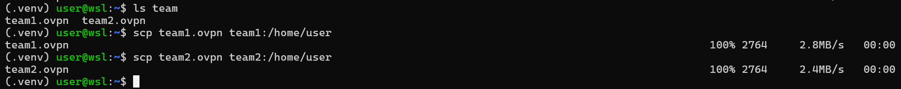

Now, let's SSH to team 1, then move the file `team1.ovpn` from `/home/user/team1.ovpn` to `/etc/openvpn/team1.conf`:

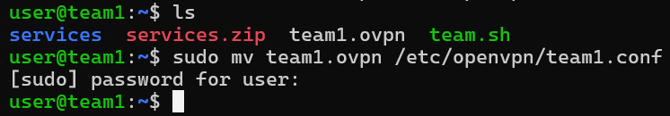

To start openvpn on team 1, type:

```bash
sudo systemctl start openvpn@team1
sudo systemctl enable openvpn@team1
```

If VPN is on, we can see ip is assigned and we can ping to server:

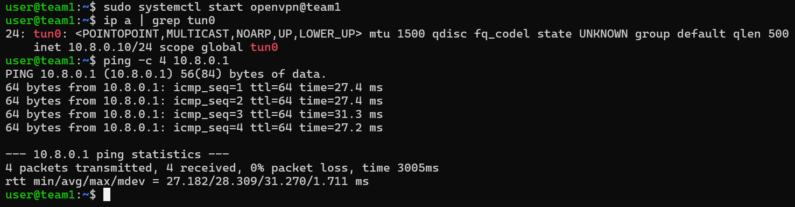

On our host, or another host, run config `player.ovpn` first:


Now let's try to SSH to team 1, whose IP is `10.8.0.11`:

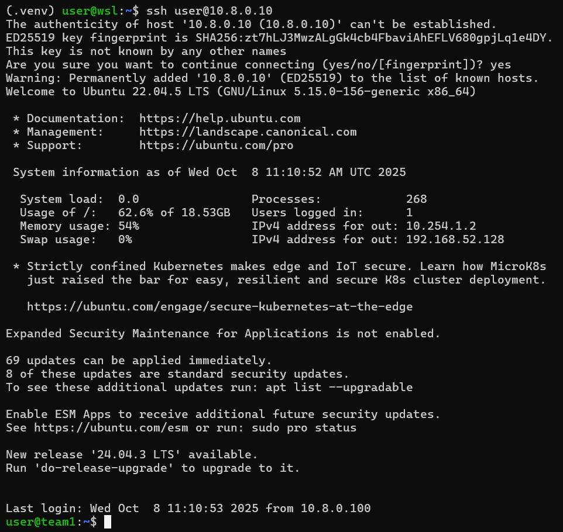

Setup for team 2 is similar:

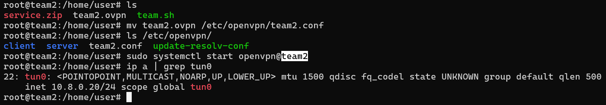

If everything is correct, we can SSH to our team 2:

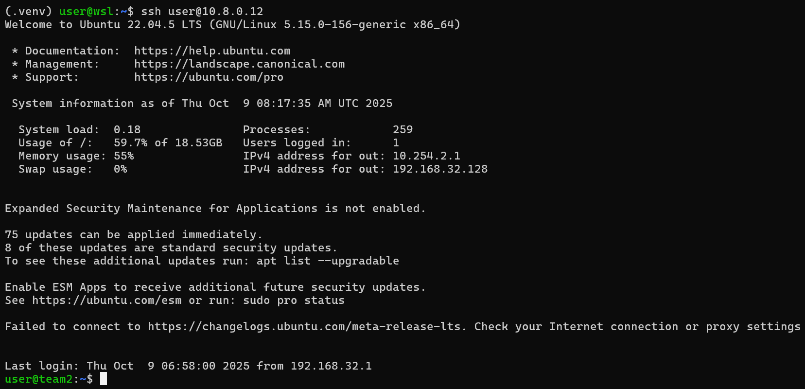
