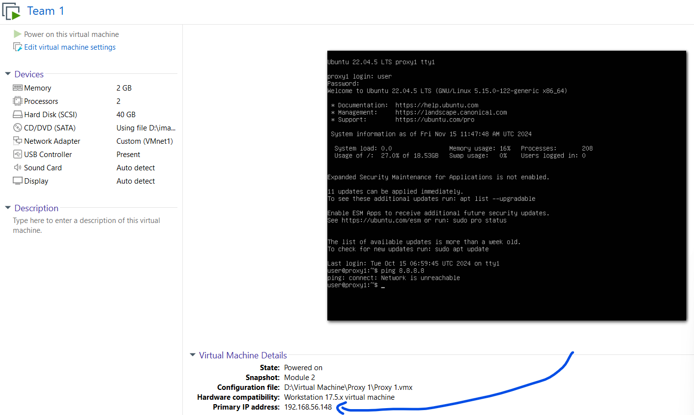
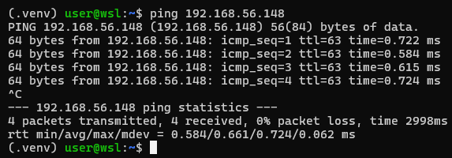
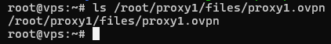
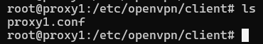
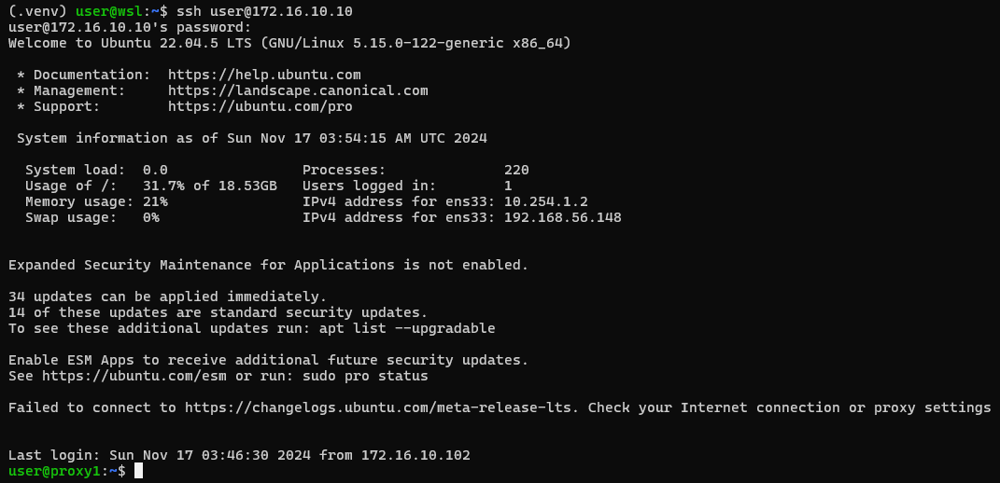

# Attack & Defense Lab (module 2)

> 1 machine for checker, scoreboard

> 2 machines for teams containing services

## VMware configuration

### ------ **Central machine**

First, we will need to install 3 network adapter on **central** machine (remember to match VMnet with the correct adapter name):
- `Network Adapter` is set to **NAT**
- `Network Adapter 2` is set to **VMnet1**
- `Network Adapter 3` is set to **VMnet2**:


### ------ **Team machine**

Now we will config `Network Adapter` of team 1 into **VMnet1**:


Then we will config `Network Adapter` of team 2 into **VMnet2**:


Then we go to `Edit -> Virtual Network Editor...`:


and click `Change Settings` to config **VMnet1** and **VMnet2**:


Now we will want 2 vmnets have both **Host connection** connected and **DHCP** enabled by ticking at 2 boxes:


and it should look like this:


That's all we needed. Now let's setup necessary stuff!

## Installation

### ------ **Central machine**

On central, we already have access to Internet because of NAT adapter so let's install on central first. We will transfer `central.sh` into machine using `scp` and then run that script with these required parameters:

```bash
./central.sh [OPTION]... -f FORCAD-URL -c CHECKER-URL --lo SERVER-IP --ip1 IP1 --ip2 IP2
```

Explanation:
- `FORCAD-URL`: link to download ForcAD.zip
- `CHECKER-URL`: link to download checkers.zip
- `SERVER-IP`: general ip that all team will use to attack (or view scoreboard)
- `IP1`: ip of server to communicate with team1
- `IP2`: ip of server to communicate with team2

For example, I will assume team 1's network is `10.254.1.0/24` and team 2's network is `10.254.2.0/24` so I can set `--ip1` to `10.254.1.1`, `--ip2` `10.254.2.1` and server ip to `10.254.0.254`. For `ForcAD.zip` and `checkers.zip`, you can get it from release section. Below is an example of full command running `central.sh` (you will need to generate new link for those files):

```bash
./central.sh -f https://download1528.mediafire.com/h4az9jqmejfg6olNoEZ_EnD9qNJBY_IqkKadXd23l8ZFyjHepzJiwqGUZ2V6fbuDJC2wMD68Jw25DKiFfN7acEY-AV5zLDjdGhFEFISJQFkN0rVFd8HBjd76EPu0O8CebQxzFQV8fMU72d6OanVW1reTdX1qgUncI_QuhgQ0ug/dxj0c3wt67tjcr8/ForcAD.zip -c https://download1479.mediafire.com/zankd1kz41wgQ8zcV-MnWa4WGUco7hWMYPUC5052p5EgQZKjBRATq0w0XFx1Aki6LnraSsHNlXQOrguGJm2hUe3Aq3xumBuuRuzO-ckNEroR-Y9OHwhSfhWlyo2qsd3hE45hdYR3Nh9vRST9uAh0jmCHEanSHLhjLOlaUmHuJA/39u04c47qcr4h0j/checkers_1.zip --if1 ens34 --ip1 10.254.1.1 --if2 ens38 --ip2 10.254.2.1
```

> This script will also generate a new SSH key pair and put private key in `/ForcAD/checkers` just in case you need it.

Now we will want central machine to route traffic from team 1 to team 2 and vice versa. The tool we will use is `nginx`. Below is an example for `/etc/nginx/nginx.conf` that you will want to modify:

```
worker_processes auto;
pid /run/nginx.pid;
include /etc/nginx/modules-enabled/*.conf;

events {
        worker_connections 768;
}

stream {
    server {
        listen 40101;
        proxy_pass 10.10.1.2:9001;
    }
    server {
        listen 40201;
        proxy_pass 10.10.2.2:9001;
    }
}
```

Explaination:
- `listen`: Port that central will bind on
- `proxy_pass`: Destination that central will redirect traffic to

Copy that config and save as file in `/etc/nginx/nginx.conf` (there is already `nginx.conf` so you can replace that with this config), then run the command below to check if config is correct:

```
nginx -t
```

If config is correct, we will get successful message:


With correct config, we will need to restart nginx service to update with new configuration:

```
systemctl restart nginx
```

Central machine is now set. Let's setup on team machine!

### ------ **Team machine**

With option **Host connection** connected we have configured previously, our host machine can ping to vmware machine of team 1 and team 2 with ip assigned by DHCP:





So let's `scp` the script `team.sh` into machine, then `ssh` into it and we can run that script to setup team machine. Assuming that server is running at ip `10.254.1.1` and in network `10.254.1.0/24` so we will choose client ip is `10.254.1.2`. Below is an example of full command running `team.sh`:

```bash
./team.sh -s https://download1479.mediafire.com/25o8m8prcfjgcB-GE4TSzFmlAv7zU2Gdki_fY9jydo1cBScSvPXrDPFIxGWwEoc52Nfaw0tLfEkBjQRWSuN-9udgZ_5D1891J1Y6H0ltgo7aS8j9c5tm-036JGJ-Qp3Y-Ci6YSAKLyBODXAx97zqR6l0l5qZm1W-65sbS33qfSMXxQ/vszd1tzthg1fi3s/services_1.zip --cip 10.254.1.2 --sip 10.254.1.1
```

If a challenge need to put flag via SSH, you can copy public key from central in `/root/.ssh/id_rsa.pub` into team machine.

Now we want to make team machine can be accessed from the internet, we will use openvpn to achieve that. With team 1, transfer `/root/proxy1/files/proxy1.ovpn` from vps (which hosts openvpn-server) to team machine at `/etc/openvpn/client` and rename it from `proxy1.ovpn` into `proxy1.conf`:





To start openvpn on team 1 and with filename of config is `proxy1.conf`, we just need to type:

```bash
systemctl start openvpn-client@proxy1
```

Now team 1 has joined network of openvpn, we just need to download `client.ovpn` from vps (at `/root/client/files/client.ovpn`) and run on our host machine and we can SSH into team 1 machine from net:



Setup for team 2 is similar as team 1.
