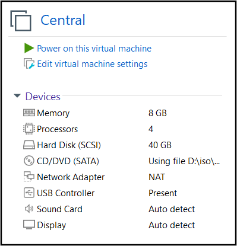
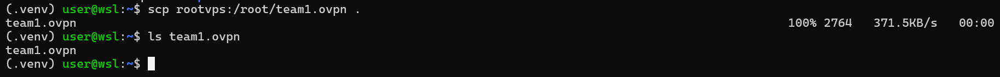
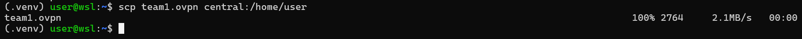
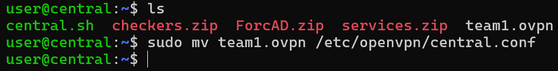
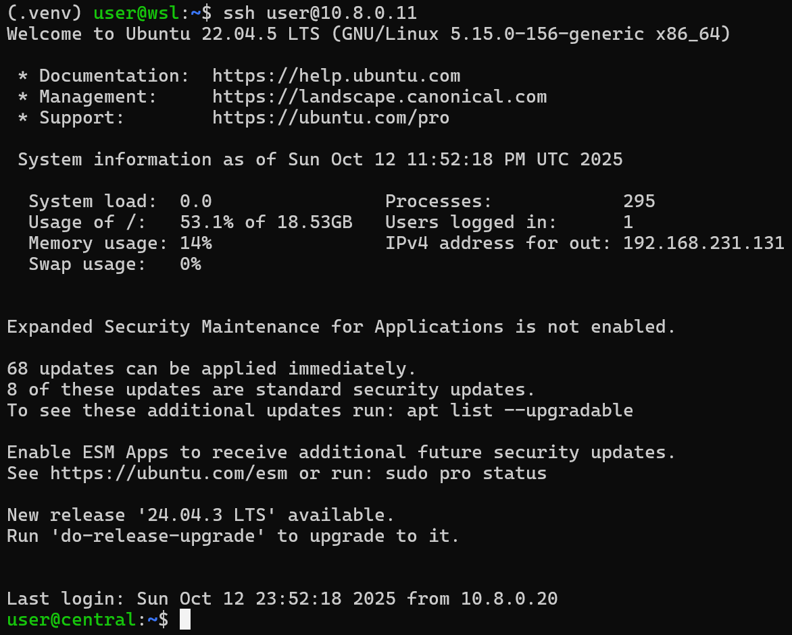

# Attack & Defense Lab (module 3)

> 1 machine host all services of all teams

## VMnet Configuration

We only need 1 network adapter that is set to **NAT**:



## Setup

Let's transfer `central.sh` into machine using `scp` and then run that script with these required parameters:

```bash
./central.sh [OPTION]... --out INTERFACE_OUT [-f FORCAD_URL] [-c CHECKER_URL] [-s SERVICE_URL]
```

Below is an example of full command running `central.sh`:

```bash
./central.sh --out ens33 -f https://github.com/ -c https://github.com/ -s https://github.com/
```

If a challenge need to put flag via SSH, you can copy public key from `central` in `/root/.ssh/id_rsa.pub` into services.

After running the script, let's download VPN configs to our host (I will use config `team1.ovpn` from [this guide](../OPENVPN_SETUP.md)):



Then let's copy that config to central machines:



Now, let's SSH to central, then move the file `team1.ovpn` from `/home/user/team1.ovpn` to `/etc/openvpn/central.conf`:



To start openvpn on central, type:

```bash
sudo systemctl start openvpn@central
sudo systemctl enable openvpn@central
```

If VPN is on, we can see ip is assigned and we can ping to server:


On our host, or another host, run config `player.ovpn` first:


Then let's try to SSH to central, whose IP is `10.8.0.11`:



Now, you just need to setup another SSH server on that central with different port and player can SSH to that!

<!-- 
The script **`init.sh`** will config the **`Network Adapter 2`**'s ip to **`192.168.0.1/24`** so that bot can use this ip to check services.

- Building challenge

Script **init.sh** will also generate ssh key and store it in `/root/.ssh/` so when writing docker, you can take the template in `services` folder and build with command below:

```bash
docker compose build --build-arg SSHKEY="`cat /root/.ssh/id_rsa.pub`"
```

After it built successful, we can run challenge docker with the following command:

```bash
docker compose up --detach
```

- Building ForcAD

In this module, I think I will want the checker to ssh as root to service docker and update flag so we will need to move the sshkey from `/root/.ssh/id_rsa` to `/ForcAD/id_rsa` so that it can include the key to checker container and the checker can work!
 -->