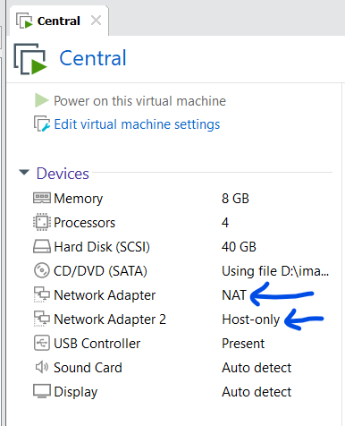

# Attack & Defense Lab (module 2)

> 1 machine host all services of all teams

## Installed application
- [ForcAD](https://github.com/pomo-mondreganto/ForcAD/releases/tag/v1.4.0)
- [Docker](https://docs.docker.com/engine/install/ubuntu/)
- Openvpn

## Setup
First, we will need to install 2 network adapter, first one is set to **NAT** and second one is set to **Host-only**:



The script **init.sh** will config the second adapter ip to **`192.168.0.1/24`** so that bot can use this ip to check services.

- Building challenge
In addition, **init.sh** will also generate ssh key and store it in `/root/.ssh/` so when writing docker, you can take the template in challenge folder and build with command below:

```bash
docker compose build --build-arg SSHKEY="`cat /root/.ssh/id_rsa.pub`"
```

After it built successful, we can run challenge docker with the following command:

```
docker compose up --detach
```

- Building ForcAD

In this lab, I designed the checker to ssh as root to service docker and update flag in that so we will need to move the sshkey from `/root/.ssh/id_rsa` to `/ForcAD/id_rsa` that it can include the key to checker container and the checker can work!
